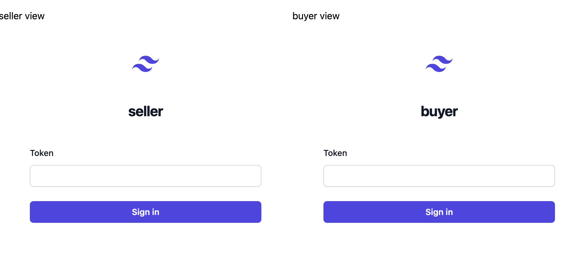
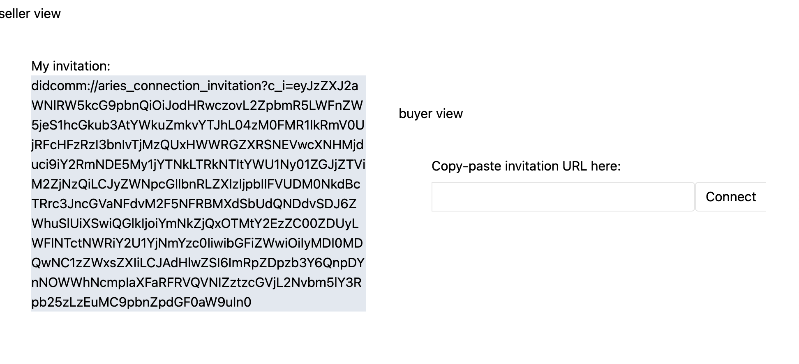
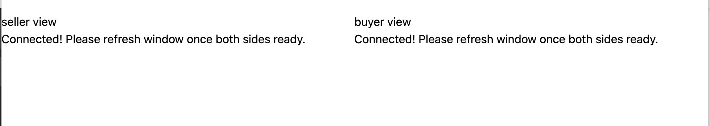
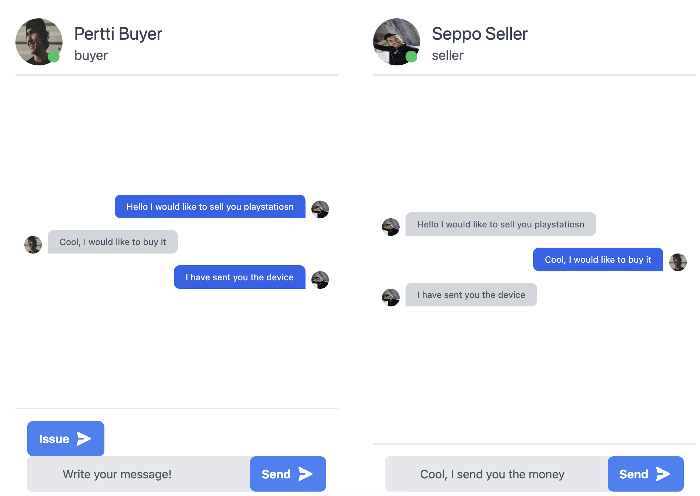
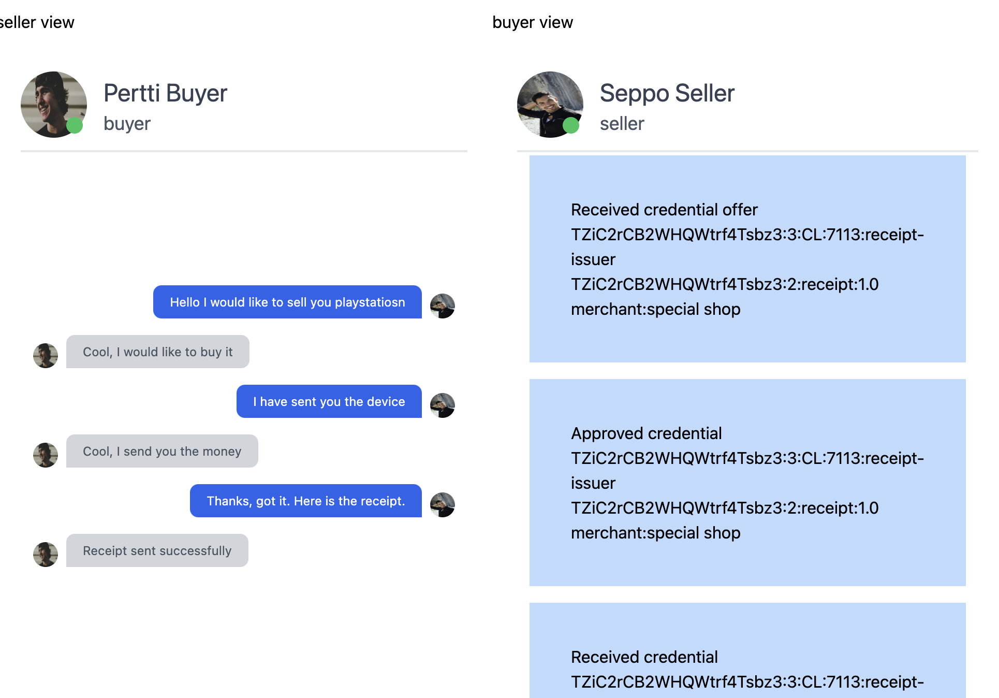

# receipt-issuer-poc

Sample for utilizing receipt-issuer bot in Findy Agency Vault API based app.

## Setup

1. **Prepare bot**

   1. Define agency URL: `export AGENCY_URL="https://agency.example.com"`
   2. Initialize and start bot:

      ```
      cd scripts
      ./issuer.sh
      ```

      The script will

      - onboard bot agent to agency
      - create needed schema with the bot agent
      - create needed cred def with the bot agent
      - prints out the URL that can be used to fetch bot invitations
      - start the bot

      The script generates a .envrc file that can be used to reset the needed environment variables for the bot.

      Note: if there are errors, it may be easier to run the needed steps manually according to the script steps. The script is just a helper.

2. **Prepare app**

   1. Define needed environment variables:

      ```
      export PUBLIC_API_URL="https://agency.example.com"
      export PUBLIC_BOT_DID="<copy this value from the invitation URL>"
      ```

   2. Start the app:

      ```
      npm install
      npm run dev
      ```

## Flow

1. Create two agents (e.g. `seller-xxx`, `buyer-xxx`) with agency's default web wallet. Copy their JWT tokens (`Developer Tools` -> `Application` -> `Local Storage` -> `https://agency.example.com` -> `token`).
2. Open sample app in <http://localhost:4321>
   
   You will see two login views. The app simulates a situation where two individuals are interacting with each other with their own app installation. The left side is seller view, right side is buyer view.
3. Paste the JWT token of the seller to the left side and sign-in. Paste buyer token to the right side and sign-in.
4. You will see invitation on seller side and text input on buyer side. Copy the invitation URL from the seller side and paste it to the buyer side.
   
5. After a while you should see following view. Refresh window.
   
6. A chat you opens. You can send messages and they will update after a while (no websockets used).
   
7. Issue receipt from seller's view using the "Issue"-button.
    
    Accepting the credential is not implemented in this sample app.
    Accepting is done in the sample flow using the default web wallet.
    You can use the default web wallet to see all of the sent messages if needed.

## What happened

- **Connecting**: In addition to creating the connection to each other,
  the buyer's and seller's agents created a connection to the issuer bot agent.
  The bot's invitation is fetched using core agency's new API for dynamic invitation generation.
  See logic [here](https://github.com/lauravuo/receipt-issuer-poc/blob/3dca42ac7a14224626209073dccc57da18a4724f/src/components/Connect.tsx#L165).
- **Chat view**: In addition to fetching the events for buyer's and seller's connection,
  the chat view fetches also the events for the bot connection.
  Only needed bot connection events are shown, most of the chat "commands" are filtered out.
- **Issuing**: The seller's agent sends [the commands](https://github.com/lauravuo/receipt-issuer-poc/blob/3dca42ac7a14224626209073dccc57da18a4724f/src/components/Chat.tsx#L172)
  to bot for issuing the credential. In addition, it sends the bot session id to the buyer's agent.
  When buyer receives the session id, it can send the commands to the bot for receiving the credential.
- After this the credential accepting can proceed normally,
  like it would work if the seller's agent itself would have issued the credential.

## Summary

In this sample app, the seller's agent is issuing a credential using the issuer bot agent.
In the UX level, the chat view is showing the needed events
from both the buyer's and seller's connection, and the bot connection.
